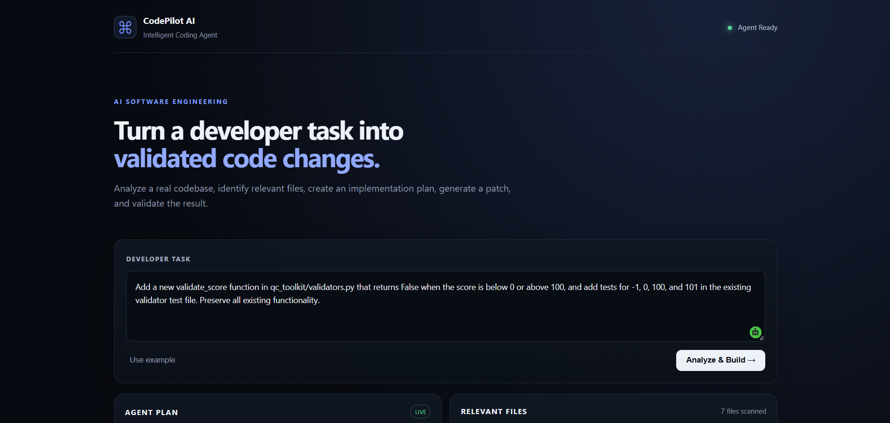
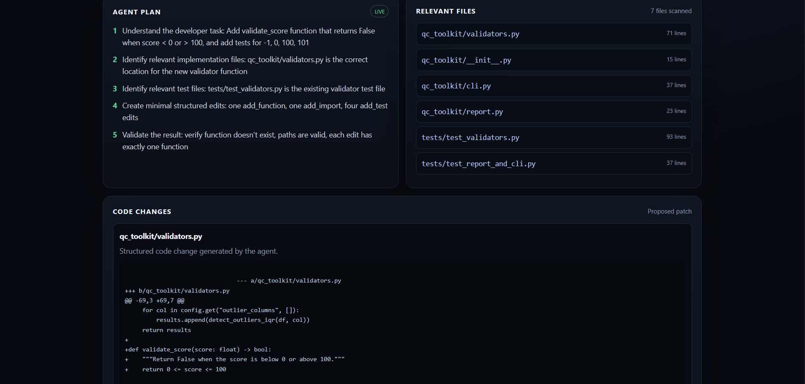
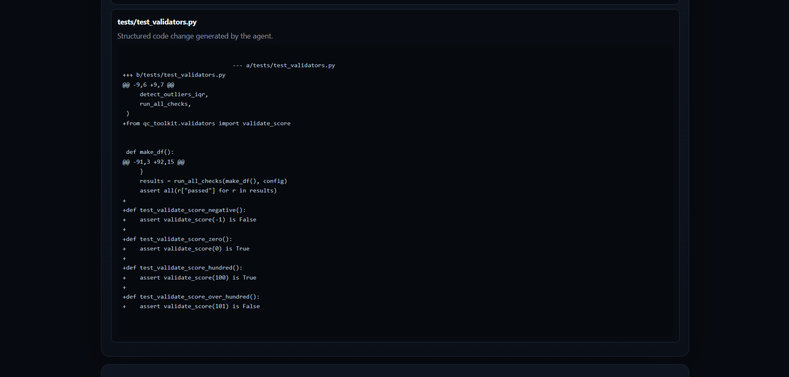
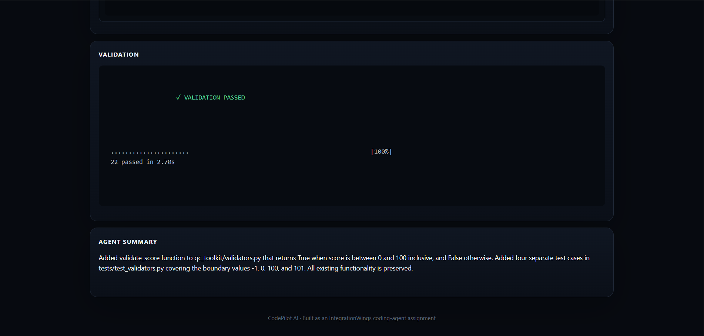

<div align="center">

# &#x1F916; CodePilot AI

## &#x1F680; Intelligent Coding Agent

### &#x2728; Turn a developer task into validated code changes

<br>

[](https://github.com/Ramchandrakanade/codepilot-ai-coding-agent)
[](https://www.python.org/)
[](https://flask.palletsprojects.com/)
[](https://github.com/Ramchandrakanade/codepilot-ai-coding-agent)

<br><br>

[](https://codepilot-ai-coding-agent.onrender.com)
[](https://github.com/Ramchandrakanade/codepilot-ai-coding-agent)

<br><br>

> &#x1F9E0; **Understand** &rarr; &#x1F4CB; **Plan** &rarr; &#x1F6E0;&#xFE0F; **Change** &rarr; &#x1F9EA; **Validate**

<br>

**An AI-powered software engineering assistant that analyzes codebases,**  
**identifies relevant files, proposes structured changes, and validates the result.**

</div>

---

## Overview

CodePilot AI is a small, deployable **AI Coding Agent** that converts a natural-language developer request into a structured and validated code change.

The agent can:

- Understand a developer task
- Inspect a codebase
- Read multiple relevant files
- Identify files related to the task
- Create an implementation plan
- Generate structured code changes
- Display the proposed changes
- Explain what was changed and why
- Run automated validation
- Report the final validation result

The goal is to demonstrate a practical **software-engineering coding-agent workflow**, rather than a simple code-generation chatbot.

---

## 📦 Upload and Analyze Your Own Project

CodePilot AI Coding Agent allows users to upload their own Python projects as ZIP files and request code changes using natural language.

## Features

- Upload a project as a ZIP file.
- Analyze project files relevant to the requested task.
- Generate proposed code changes using AI.
- Generate or update Python tests.
- Validate changes by running tests.
- Protect ZIP extraction against path traversal and oversized uploads.

## How to Use
- Open the deployed CodePilot application.
- Upload your project ZIP file.
- Enter the coding task you want the AI agent to perform.
- Review the proposed changes.
- Run validation and inspect the test results.
- Note: Review generated code and test results before using changes in a production project.

## Live Demo
- Open CodePilot AI Coding Agent

**Deployed Application**

https://codepilot-ai-coding-agent.onrender.com

**GitHub Repository**

https://github.com/Ramchandrakanade/codepilot-ai-coding-agent

---

## How CodePilot AI Works

```text
                    Developer Task
                          |
                          v
                  Codebase Analysis
                          |
                          v
                Relevant File Selection
                          |
                          v
                  Implementation Plan
                          |
                          v
                Structured Code Changes
                          |
                          v
                     Patch / Diff
                          |
                          v
                 Automated Validation
                          |
                          v
                    Agent Summary
````

The workflow follows the same basic process a developer would use:

**Understand → Inspect → Plan → Change → Validate → Explain**

---

## Key Features

### Natural-Language Developer Tasks

The developer can enter a coding request using normal language.

Example:

```
Add a new validate_score function in qc_toolkit/validators.py
that returns False when the score is below 0 or above 100,
and add tests for -1, 0, 100, and 101 in the existing
validator test file.

Preserve all existing functionality.
```

---

### Codebase Analysis

The agent scans the supplied project and reads multiple files before deciding which files are relevant.

For the sample project, it can inspect:

```
qc_toolkit/
├── __init__.py
├── cli.py
├── report.py
└── validators.py

tests/
├── test_report_and_cli.py
└── test_validators.py
```

---

### Relevant File Selection

The agent identifies the files that are directly related to the developer request.

For example:

```
Implementation:
qc_toolkit/validators.py

Tests:
tests/test_validators.py
```

This helps avoid unnecessary changes to unrelated files.

---

### Implementation Planning

Before generating changes, CodePilot AI creates an explicit implementation plan.

Example:

```
1. Understand the developer request
2. Identify the relevant implementation file
3. Identify the relevant test file
4. Create the requested function
5. Add the required import
6. Add boundary-value tests
7. Run automated validation
8. Report the result
```

---

### Structured Code Changes

Instead of blindly rewriting complete files, the agent generates structured edits.

Supported operations include:

```
add_function
add_test
add_import
replace_function
append_text
```

This makes the generated changes easier to review and control.

---

### Patch / Diff View

The application displays the generated changes so that the developer can review what the agent proposes before accepting the result.

This provides visibility into:

```
What changed?
Where did it change?
Why was it changed?
```

---

### Automated Validation

After generating the changes, CodePilot AI runs the project's automated test suite.

Example:

```
VALIDATION PASSED

22 passed
```

This gives the developer evidence that the generated change does not immediately break the project.

---

## Example Workflow

### Developer Request

```
Add a new validate_score function in qc_toolkit/validators.py
that returns False when the score is below 0 or above 100,
and add tests for -1, 0, 100, and 101 in the existing
validator test file.

Preserve all existing functionality.
```

### Agent Identifies

```
Implementation File:
qc_toolkit/validators.py

Test File:
tests/test_validators.py
```

### Generated Function

```
def validate_score(score: float) -> bool:    """Return True if score is between 0 and 100 inclusive."""    return 0 <= score <= 100
```

### Generated Tests

```
def test_validate_score_negative_returns_false():    assert validate_score(-1) is Falsedef test_validate_score_zero_returns_true():    assert validate_score(0) is Truedef test_validate_score_hundred_returns_true():    assert validate_score(100) is Truedef test_validate_score_above_hundred_returns_false():    assert validate_score(101) is False
```

### Validation Result

```
VALIDATION PASSED

22 passed
```

---

## Architecture

```
┌───────────────────────────────┐
│        Web Interface          │
│          Flask UI             │
└───────────────┬───────────────┘
                │
                v
┌───────────────────────────────┐
│       Agent Orchestrator      │
└───────────────┬───────────────┘
                │
                v
┌───────────────────────────────┐
│       Codebase Scanner        │
│       File Selection          │
└───────────────┬───────────────┘
                │
                v
┌───────────────────────────────┐
│        LLM Analysis           │
│    Task + Repository Context  │
└───────────────┬───────────────┘
                │
                v
┌───────────────────────────────┐
│      Structured Edits         │
│ add_function / add_test /     │
│ add_import / replace_function │
└───────────────┬───────────────┘
                │
                v
┌───────────────────────────────┐
│        Edit Engine            │
│     Patch / Change Review     │
└───────────────┬───────────────┘
                │
                v
┌───────────────────────────────┐
│      Validation Runner        │
│            Pytest             │
└───────────────┬───────────────┘
                │
                v
┌───────────────────────────────┐
│        Agent Summary          │
└───────────────────────────────┘
```

---

## Project Structure

```
CodePilot-AI-Coding-Agent/
│
├── app/
│   ├── agent/
│   │   ├── codebase.py
│   │   ├── edit_engine.py
│   │   ├── llm.py
│   │   ├── orchestrator.py
│   │   ├── prompts.py
│   │   └── validator.py
│   │
│   ├── static/
│   │   ├── app.js
│   │   └── style.css
│   │
│   ├── templates/
│   │   └── index.html
│   │
│   └── main.py
│
├── sample_project/
│   ├── qc_toolkit/
│   │   ├── __init__.py
│   │   ├── cli.py
│   │   ├── report.py
│   │   └── validators.py
│   │
│   └── tests/
│       ├── test_report_and_cli.py
│       └── test_validators.py
│
├── tests/
│   ├── test_report_and_cli.py
│   └── test_validators.py
│
├── data/
│   └── sample.csv
│
├── run.py
├── requirements.txt
├── Procfile
├── pytest.ini
├── .gitignore
└── README.md
```

---

## Main Components

| Component         | Responsibility                                |
| ----------------- | --------------------------------------------- |
| `codebase.py`     | Scans and reads repository files              |
| `orchestrator.py` | Coordinates the coding-agent workflow         |
| `llm.py`          | Handles LLM interaction and structured output |
| `prompts.py`      | Defines agent instructions and safety rules   |
| `edit_engine.py`  | Applies and validates structured code edits   |
| `validator.py`    | Runs automated project validation             |
| `main.py`         | Flask application and API endpoints           |
| `app.js`          | Frontend interaction                          |
| `style.css`       | Dashboard styling                             |

---

## Technology Stack

| Technology              | Purpose                      |
| ----------------------- | ---------------------------- |
| Python                  | Core application             |
| Flask                   | Web application              |
| OpenRouter / Qwen       | LLM-powered code analysis    |
| Ollama / Qwen           | Local LLM development        |
| Pytest                  | Automated validation         |
| Pandas                  | Sample project functionality |
| HTML / CSS / JavaScript | Web interface                |
| Render                  | Cloud deployment             |
| GitHub                  | Source control               |

---

## Running Locally

### 1. Clone the Repository

```
git clone https://github.com/Ramchandrakanade/codepilot-ai-coding-agent.git
cd codepilot-ai-coding-agent
```

### 2. Create a Virtual Environment

Windows:

```
python -m venv .venv
.venv\Scripts\activate
```

Linux / macOS:

```
python3 -m venv .venv
source .venv/bin/activate
```

### 3. Install Dependencies

```
pip install -r requirements.txt
```

### 4. Configure the AI Provider

Create a `.env` file:

```
AI_PROVIDER=ollama
OLLAMA_MODEL=qwen2.5-coder:3b
```

For hosted deployment, configure the required provider environment variables through the hosting platform.

Do not commit API keys, tokens, passwords, or `.env` files.

### 5. Start the Application

```
python run.py
```

Open:

```
http://127.0.0.1:5000
```

---

## AI Configuration

CodePilot AI supports an LLM-based workflow with provider configuration through environment variables.

Example local configuration:

```
AI_PROVIDER=ollama
OLLAMA_MODEL=qwen2.5-coder:3b
```

Hosted environments can use the configured AI provider through environment variables.

Secrets are never stored directly in the source code.

---

## Testing

Run the complete test suite:

```
python -m pytest -q --import-mode=importlib
```

Current validation:

```
22 passed
```

The test suite validates the sample project and helps verify that generated changes preserve existing functionality.

---

## Safety and Change Controls

CodePilot AI is designed with several safeguards:

- Existing functions are not duplicated
- Existing functionality should be preserved
- New functions must match the requested task
- Requested files are checked
- Generated imports are validated
- Generated tests are validated
- Structured edits are used instead of complete-file rewriting
- Generated changes are reviewable
- Automated validation is performed after changes
- API keys and credentials are kept outside the repository

The agent does not automatically commit generated changes to Git.

---

## Design Principles

### Understand Before Changing

The agent first analyzes the developer request and repository context.

### Relevant File Selection

Only files related to the task should be selected for modification.

### Minimal Changes

The agent aims to make the smallest practical change required by the request.

### Preserve Existing Functionality

Existing code should remain unchanged unless the developer explicitly requests a modification.

### Validate the Result

Generated changes should be tested before being considered successful.

### Reviewable Output

The application shows the plan, relevant files, changes, validation result, and final summary.

---

## Assumptions

- The application operates on the bundled sample project.
- The sample project contains Python source files and pytest tests.
- An LLM provider is available through environment configuration.
- API credentials are supplied through environment variables when required.
- Generated changes are intended to be reviewed and validated before being used in a production repository.

---

## Limitations

- The current application works with the bundled sample project rather than arbitrary large repositories.
- Repository retrieval and context selection are intentionally lightweight.
- The application demonstrates a small but complete coding-agent workflow.
- LLM output quality depends on the selected model and provider.
- Generated changes are proposed and validated; they are not automatically committed to Git.
- Very large or highly complex codebases may require more advanced retrieval and indexing.

---

## IntegrationWings Assignment Coverage

| Assignment Requirement          | Implementation                        |
| ------------------------------- | ------------------------------------- |
| Web UI or CLI                   | Flask Web UI                          |
| Natural-language developer task | Developer Task input                  |
| Show a plan                     | Agent Plan panel                      |
| Sample repository/project       | `sample_project/`                     |
| Read multiple files             | Codebase scanner                      |
| Identify relevant files         | Relevant Files panel                  |
| Understand the request          | LLM task analysis                     |
| Inspect relevant files          | Repository context                    |
| Suggest or make changes         | Structured edit engine                |
| Explain what changed            | Agent Summary                         |
| Show changed files / patch      | Code Changes panel                    |
| Meaningful validation           | Automated Pytest execution            |
| Local run instructions          | README                                |
| Deploy online                   | Render                                |
| LLM / agentic workflow          | LLM + orchestrator + structured tools |
| Error handling and safety       | Validation and edit safeguards        |
| Assumptions and limitations     | Documentation                         |

---

## Demo Evidence

The following screenshots demonstrate the complete CodePilot AI workflow from developer task understanding to validated code changes.

### 1. Developer Task & Agent Dashboard

The main dashboard provides the developer task input and shows the CodePilot AI agent as ready to analyze and build.



### 2. Agent Plan & Relevant Files

The agent analyzes the task, creates an implementation plan, and identifies the relevant implementation and test files.



### 3. Generated Code Changes

The agent generates a structured patch showing the requested changes to the implementation and test files.



### 4. Validation & Agent Summary

The generated changes are validated using automated tests.

**Validation Result: 22 tests passed**



---

## Assignment Workflow

```
Task Understanding
        ↓
Codebase Analysis
        ↓
Relevant File Selection
        ↓
Implementation Planning
        ↓
Structured Code Changes
        ↓
Patch / Diff Review
        ↓
Automated Validation
        ↓
Final Agent Summary
```

---

## Submission Information

**Project:** CodePilot AI — Intelligent Coding Agent

**Developer:** Ramchandra Kanade

**Degree:** B.Tech Computer Science & Engineering

**Live Application:**

[https://codepilot-ai-coding-agent.onrender.com](https://codepilot-ai-coding-agent.onrender.com)

**GitHub Repository:**

[https://github.com/Ramchandrakanade/codepilot-ai-coding-agent](https://github.com/Ramchandrakanade/codepilot-ai-coding-agent)

---

## Project Documentation

[Download Project Documentation (PDF)](docs/CodePilot_AI_README.pdf)

A PDF version of the project documentation can also be included in the repository:

```
docs/
└── CodePilot_AI_README.pdf
```

## Current Validation Limitation

The deployed agent checks patch structure, rejects unsafe patch paths, and validates Python syntax without executing generated code. It reports `TESTS NOT RUN - SANDBOX REQUIRED` until isolated test execution is configured. This is an intentional security limitation, not a passing test result.

Run the repository's own tests locally with:

```powershell
python -m pytest -q --import-mode=importlib
```
